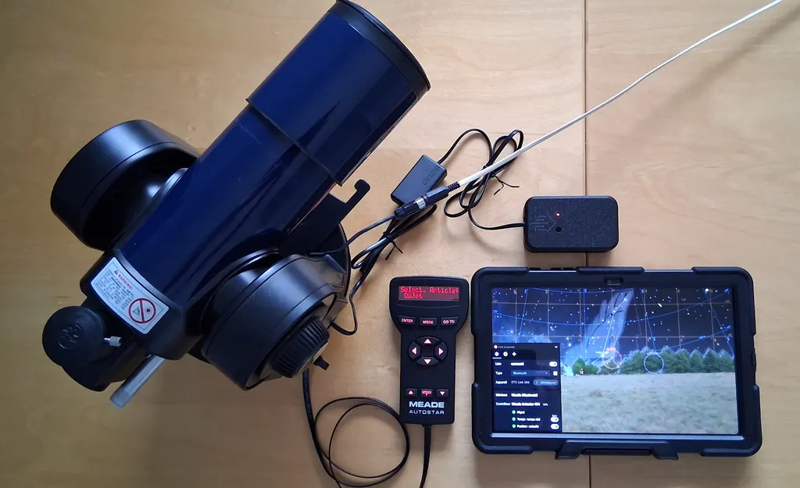

# ETX-LINK-506 for Stellarium Plus (mobile)

## **SCOPE OF PROJECT**

*Still under development. Help appreciated.*

This ETX Link 506 module has been developed for wireless communication between **Stellarium Plus for mobile** and the low-cost **Meade\* ETX-70AT** telescope using the **#506 CCS module** (*Connector Cable Set*). It cannot replace the Autostar 494 hand controller nor the #506 CCS module.

Whereas the ETX Link module has been developed for the ETX-70, it maybe used with other telescopes sharing the Autostar 494 hand controller such as ETX-60/70/80 (AT/TC), DS-2060/2070/2080/2090/1114/2114/2130 (AT), DSX and Starfinder Series but not with the LX series.

* *\* Meade Instruments company founded in 1972 in California by Jogn Diebel was famous for popularizing Schmidt-Cassegrain telescopes like the LX200 series and ETX line. It went through asset auctions in early 2025 making replacement parts a challenge.*

## **BILL of MATERIAL**

* Meade #506 CCS (*no longer available from seller*)
* ESP32 WROOM D1 Mini
* 5V-3V3 Level shifter
* DD4012SA 5V converter
* 1N5819 Schottky diode
* Piezo Buzzer
* Tack button
* LED + 3K9 resistor (*optional for COMMS*)
* 100nF / 100-470µF capacitor (*optional for power filtering*)

**IMPORTANT**: *Check the pinout of your RJ-11 connector (RS-232 SUB-D9 side) because it may differ from the one given on the diagram.*

## **QUICK START**

**Starting a session:**

* Power on the telescope
* Set the Date/Time, Time zone on the Autostar and position if not yet done.
* Set the telescope in HOME position (*Tube leveled and North aligned*)
* NOW: Depress the ETX Link button until the 1st beep to set HOME position.
* On the Autostar, proceed with the star’s alignment
* Launch and connect Stellarium Plus for mobile to ETX Link using Bluetooth (EXT Link 506)
* Ensure Time and Position are synced (*otherwise reconnect Bluetooth*)

**Ending a session:**

* Depress the ETX Link button until the 2nd beep to park the telescope.
* Power off the telescope
* Disconnect and Quit Stellarium Plus

#### **NORMAL OPERATION**

Power-up the telescope and about 2 second later you will hear a 2-tone READY beep from the ETX Link module and a low-tone beep from the Autostar handset. The module is ready to operate.

**IMPORTANT:** *The Autostar handheld display timeout blanks the LCD screen. There is no way to wake-up the display. Therefore, when ending a session, use the ETX Link module button to park the telescope tube.*

#### **Align the telescope**

Enter the Date/Time, Time zone and position if not yet done on the Autostar.

Under the Setup menu (*using direction key close to the SPEED button*), select the Alignment and Easy. Proceed with the alignment operation.

Once the telescope alignment is completed, depressed the button for about 2-second until you hear a beep then release. A 2-beep signal confirms the HOME position and telescope information have been transferred to the ETX Link module.

#### **Park the telescope**

At the end of a session, depressed the button for about 4-second until you hear a second beep. Release the button, a 3-tone beep will warn you because the telescope will move. The telescope tube will go to the parking (HOME) position.

**Reboot the device**

Once the ETX Link module is running, depressed the button for about 6-second until you hear a 3- beep. Release the button and the module will immediately reboot.

## **STARTUP OPTIONS**

#### **Reset to factory default**

To reset all parameters to factory default, keep button depressed while powering-up the telescope until the beep is audible. Release the button after the beep and the default factory settings will be restored.

## **DEVELOPMENT and DEBUG**

Communication with the ETX Link module is possible using a terminal such as Termite on the USB serial port. Connect using 115200 bauds, 8-bit data, no parity and 1-stop bit.

A second Serial Port is available for debugging using Stellarium for PC and a USB-Serial 3V3 cable adaptor. 
In Stellarium Telescope Configuration menu, select :
* Direct with serial port
* JNow
* Meade ETX-70 (#494 Autostar, #506 CCS)

#### **COMMANDS**

Some command can be sent from the console using the USB port :

* **PARK** Park telescope tube to HOME position
* **HOME** Set current position as HOME and get Autostar info (Date, Time, TZ, Lat, long)

* **MOUNT=** Set telescope mount type Polar=0 or AltAz=1 (reboot required)
* **COMMS=** Select astro application source from AUX=0 or BLT=1 (reboot required)

* **PARAMS** Print ETX Link module parameters
* **LOG** Print LX200 debug messages
* **SAVE** Save parameters (this make parameters permanent and survive reboot)
* **BOOT**  Reboot module

Any LX200 commands can be sent using the console but also used to configure the ETX Link module or the Autostar handset:

    #:SGsHH.H# Set Time zone* (Paris #:SG-02.0# to GMT)

    #:SCMM/DD/YY# Set Date (e.g. #:SC09/25/26#)

    #:SLHH:MM:SS# Set Local Time (e.g. #:SL17:35:00#)

    #:StsDD*MM# Set Latitude (Paris #:St+48*51# +North, -South)

    #:SgsDDD*MM# Set Longitude (Paris #:Sg002*20# [0-360] CW)

\* *LX200 protocol requires inverted sign.*

### **DEVELOPMENT**

For those who are motivated to carry on with the development and try to fix remains issues, the code files are available in the SRC folder for an ESP32 WROOM D1 Mini with Arduino IDE. Feel free to keep me updated on your progresses.

## **ASTRO APPLICATIONS**

If Stellarium Plus stops responding or communication fails:

#### **Keep the Screen Awake:**

* Go to: Settings > Display > Screen timeout (or Sleep / Auto screen off depending on your tablet brand).
* Select: 10 minutes, 30 minutes, or Never to prevent the tablet from sleeping during observation.
* Alternative: some telescope apps have a built-in menu, check Settings > User Interface > Keep screen on.

If this does not solve your problem, consider tuning the parameters below:

#### **Disable battery optimization.**

* Go to Settings > Apps > your\_app > App battery usage > Unrestricted (usually set to Optimized).

**Configure Location Permissions:**

* Go to: Settings > Location > App permissions > your\_app.
* Select: "Allow all the time" (do not use "Allow only while using the app").
* Turn on: "Use precise location".

## **TROUBLESHOOTING**

For debugging you can use a Putty/Termite console connected to the USB serial port.

The problems are primarily due to the complex firmware design of the Autostar #494/#506 CSS and the absence of technical documentation. We are very grateful to the community members who previously helped decipher the Meade software.

**Communication hangs:**

This behavior is inherent to ETX series with Autostar #494 handset and #506 CCS module. The serial communication can pause for about 10 seconds before restarting causing some potential issues such as telescope marker blocked or GOTO/SYNC command ignored.

The problem is due to the polling. The Autostar constantly send a pattern (0x03 0x11 0x03) to the #506 CCS which must reply with the message length if any. But random shifts in the datagram synchronization lead to a high level (0xFF) instead of the message length. Therefore the Autostar is waiting for 255 characters and pause.

**SYNC command 'sometimes' crash the Autostar**

You can reproduce this problem just by connecting the #506 CCS module to Stellarium for PC or just a terminal and send commands (Sr/Sd/MS/CM) by yourself. To avoid this, I just ignore SYNC commands sent from Stellarium.

--> In the Code we have disabled the SYNC command but this can be an issue because the tracking is not enabled after a Goto.

